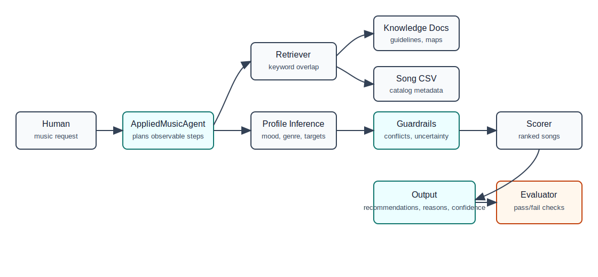
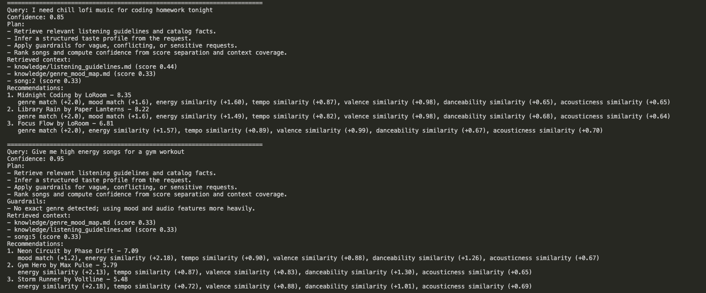
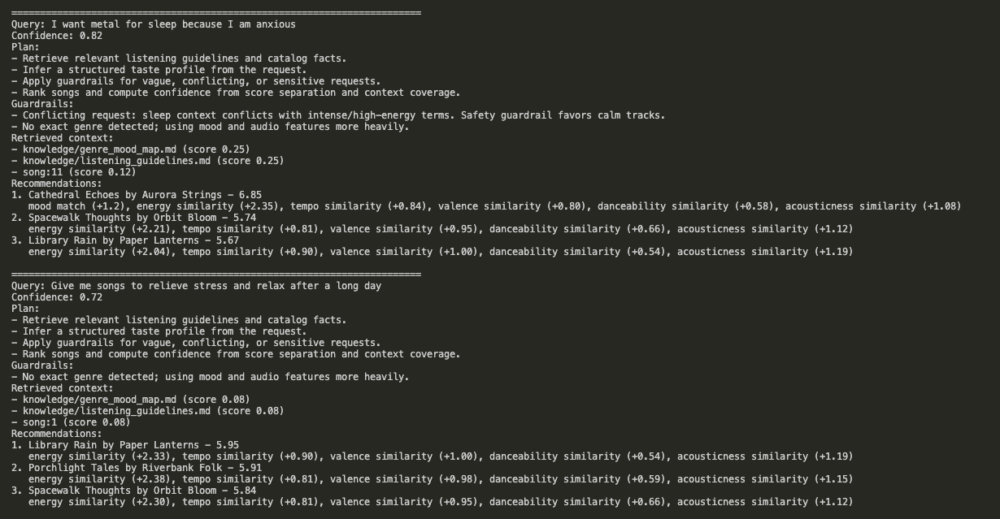

# VibeMatch Applied AI System

VibeMatch is a retrieval-augmented music recommendation system that turns a natural-language listening request into ranked song recommendations with explanations, confidence scoring, guardrails, and an evaluation harness.

## Original Project

Base project: `Project3_MusicRecommenderSimulation`.

The original Module 3 project was a content-based music recommender. It loaded a small CSV catalog, compared each song against a structured user profile, scored genre/mood/numeric feature similarity, and printed top recommendations with short explanations. This final version keeps that scoring engine but wraps it in an applied AI workflow that can interpret free-text user requests, retrieve custom context, apply guardrails, and evaluate reliability.

## What The System Does

- Accepts natural-language requests such as "chill lofi music for coding homework."
- Retrieves relevant context from custom documents in `knowledge/` and song metadata from `data/songs.csv`.
- Infers a structured taste profile: genre, mood, energy, tempo, valence, danceability, and acousticness.
- Applies guardrails for vague, emotionally sensitive, or conflicting requests.
- Ranks songs with the original recommender logic.
- Prints an observable plan, retrieved context, recommendations, explanations, and a confidence score.
- Logs each run to `logs/system.log`.
- Includes automated tests and an evaluation script.

## Architecture Overview



Data flow:

1. A human enters a music request.
2. `AppliedMusicAgent` retrieves matching context from project knowledge docs and song metadata.
3. The agent infers a structured profile from the request.
4. Guardrails adjust unsafe or conflicting requests, such as asking for intense music for sleep.
5. The content-based scorer ranks the catalog.
6. The system returns recommendations with reasons and confidence.
7. `src/evaluate.py` checks expected behavior across predefined scenarios.

## Project Structure

```text
assets/                 System diagram files
data/songs.csv          Song catalog
knowledge/              Custom retrieval documents
src/applied_ai_system.py Retrieval, planning, guardrails, confidence
src/recommender.py      Original scoring engine
src/main.py             End-to-end CLI demo
src/evaluate.py         Reliability evaluation script
tests/                  Unit and behavior tests
model_card.md           Ethics, limitations, and reflection
```

## Setup

```bash
python -m venv .venv
source .venv/bin/activate
pip install -r requirements.txt
```

Run the end-to-end demo:

```bash
python -m src.main
```

Run tests:

```bash
pytest -q
```

Run the reliability evaluation:

```bash
python -m src.evaluate
```

## Sample Interactions

### Input 1

```text
I need chill lofi music for coding homework tonight
```

Output summary:

```text
Confidence: 0.85
Retrieved context: listening_guidelines.md, genre_mood_map.md, song:2
1. Midnight Coding by LoRoom - genre match, mood match, energy/tempo similarity
2. Library Rain by Paper Lanterns - genre match, mood match, acousticness similarity
3. Focus Flow by LoRoom - genre match, focus-friendly audio features
```

### Input 2

```text
Give me high energy songs for a gym workout
```

Output summary:

```text
Confidence: 0.95
Guardrail: No exact genre detected; using mood and audio features more heavily.
1. Neon Circuit by Phase Drift
2. Gym Hero by Max Pulse
3. Storm Runner by Voltline
```

### Input 3

```text
I want metal for sleep because I am anxious
```

Output summary:

```text
Confidence: 0.82
Guardrail: sleep context conflicts with intense/high-energy terms, so calm tracks are favored.
1. Cathedral Echoes by Aurora Strings
2. Spacewalk Thoughts by Orbit Bloom
3. Library Rain by Paper Lanterns
```

## Design Decisions

I used deterministic retrieval and scoring instead of an external LLM so the project is reproducible without API keys. The RAG layer retrieves both custom listening guidelines and catalog metadata, then the agent uses that context to infer the profile that drives recommendations. This makes the AI behavior inspectable: every run shows the plan, retrieved sources, inferred profile effects, confidence, and guardrail warnings.

The main trade-off is flexibility versus reliability. A full LLM could understand more nuanced language, but it would be harder to test and might produce inconsistent outputs. This version handles a smaller set of intents but is easier to debug and evaluate.

## Reliability And Evaluation

Reliability tools included:

- Unit tests for the original scoring logic.
- Behavior tests for RAG context retrieval and guardrail behavior.
- `src/evaluate.py`, a test harness with four predefined user requests.
- Confidence scoring based on top-score separation, retrieved-context coverage, and warning penalties.
- Runtime logging in `logs/system.log`.

Current result:

```text
pytest: 4 passed
evaluation: 4/4 checks passed
```

What worked: clear requests for lofi study, workout music, and calm sleep music produced expected top results. The guardrail correctly overrode the conflicting "metal for sleep" request. What did not work perfectly: vague requests still depend on keyword matching, so the system lowers confidence and explains uncertainty instead of pretending to know more than it does.

## Reflection And Ethics

Limitations and bias: The catalog is tiny and hand-labeled, so recommendations reflect the available genres and feature values. Exact keyword parsing can miss slang, multilingual requests, or mixed preferences. The system can also over-recommend similar songs because it optimizes fit rather than diversity.

Possible misuse: This should not be used as mental health advice or as a claim that music can treat anxiety, sadness, or sleep problems. Guardrails avoid therapeutic claims and favor lower-risk recommendations when emotional or sleep-related terms appear.

Reliability surprise: The guardrail case was the most interesting test. Without the guardrail, a literal genre match could recommend intense metal for sleep. Adding a simple conflict check made the output more responsible.

AI collaboration: AI assistance was helpful for brainstorming the agent workflow and evaluation cases. One flawed suggestion was to make the system sound more like a general chatbot; I kept it narrower because a constrained, testable recommender is more reliable for this project.

## Presentation And Walkthrough

The command below runs the end-to-end applied AI workflow:

```bash
python -m src.main
```

When `src.main` runs, it creates an `AppliedMusicAgent` and sends several demo prompts through the full system. For each prompt, the agent prints the user query, confidence score, observable plan, retrieved context, guardrail warnings when needed, and the final ranked song recommendations with scoring explanations.

### Demo Screenshot 1



In this screenshot, the first prompt asks for chill lofi music for coding homework. The system retrieves both listening guidelines and the genre/mood map, infers a lofi-focused study profile, then recommends `Midnight Coding`, `Library Rain`, and `Focus Flow`. The second prompt asks for high-energy gym music. Because no exact genre is provided, the guardrail lowers the importance of genre and lets energy, danceability, tempo, and mood drive the recommendation list.

### Demo Screenshot 2



This screenshot demonstrates the reliability and guardrail behavior. The request "metal for sleep because I am anxious" contains conflicting signals, so the system warns that sleep conflicts with intense/high-energy music and favors calm tracks instead of literal metal matches. The final stress-relief prompt is vaguer, so the system reports lower confidence and uses calm audio features and retrieved guidelines to recommend lower-energy, more acoustic songs.

For the walkthrough, run:

```bash
python -m src.main
python -m src.evaluate
```

Show the demo inputs, retrieved context, guardrails, confidence scores, recommendations, and the `4/4` evaluation summary.
